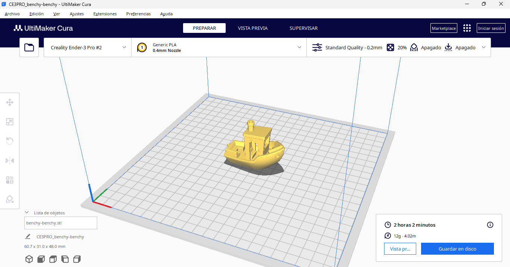
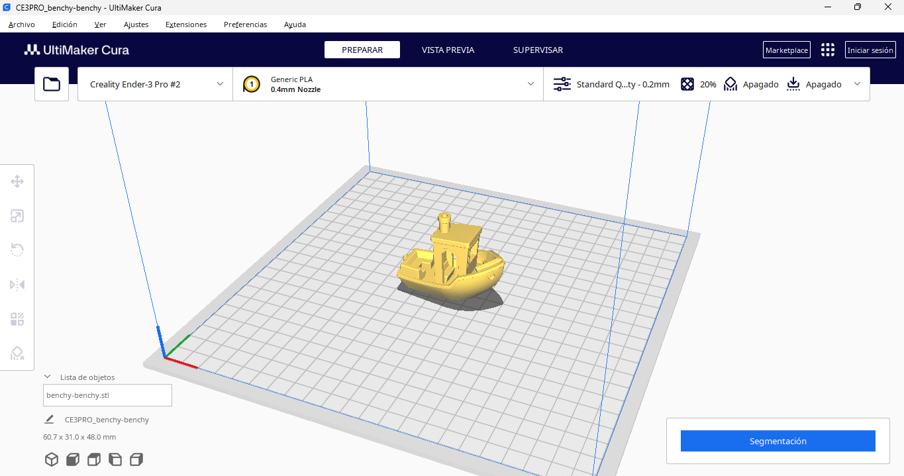
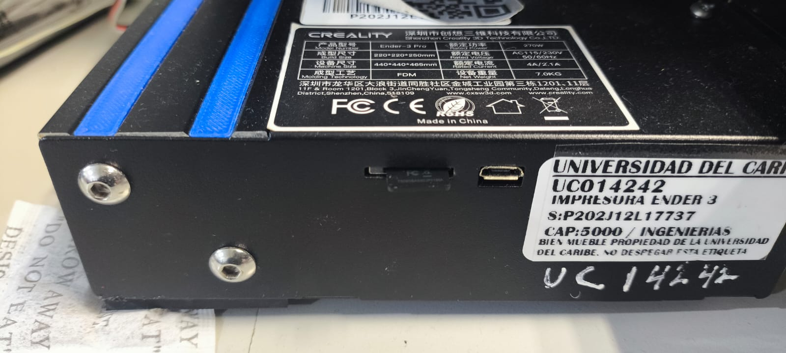
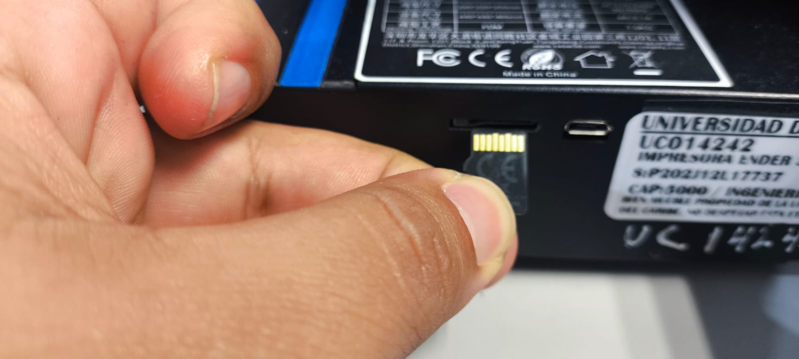

## Instalación de Ultimaker Cura

Una vez descargado el ejecutable en forma de archivo .exe, dirigete a la carpeta en donde se descargo y con click derecho sobre el elige _Ejecutar como administrador_; se nos abrirá una pestaña y daremos _Sí_.

A continuación tendremos la siguiente ventana instalación:

Daremos click en _Next_ hasta tener la ventana de instalación. Una vez instalado tendremos la siguiente ventana: 

Damos _Finish_ y se nos abrirá la ventana de configuración:

Elegiremos _Impresoras no Ultimaker_:

Damos click en _Agregar impresora fuera de red_:

A continuación buscamos en la lista de marcas _Creality3D_ y elegimos la _Crealitu Ender-3 Pro_ y damos click en _Agregar_:

En la ventana _Ajustes de la maquina_ buscamos el recuadro _Iniciar GCode_ y añadiremos los comandos [G29] y [M420 S1] despúes del comando _G28_ quedando de la siguiente manera: 

Hacemos click en _Siguiente_ y ya tendremos listo y configurado el laminador. 

## Creación del gcode

El gcode es el tipo de archivo que la gran mayoría de las impresoras 3D utiliza para imprimir. A continuación procederemos a crear uno desde cero.

Desde el botón de la carpeta podremos añadir archivos .stl, .obj o .3mf para poder imprimir; estos archivos los puedes descargar desde [Thingiverse](https://www.thingiverse.com/), [Printables](https://www.printables.com/) o [Cults 3D](https://cults3d.com/es?srsltid=AfmBOorE-9j-jBcwZQE9Yf4uGouLHmyld30yYafgzy_BtbD_Wq4PcXOo).

Como ejemplo práctico elegiremos el test de impresión _Benchy_ descarcagado del siguiente [link](https://www.printables.com/model/1207050-benchy-benchy): 

Por defecto, Cura ya viene con un perfil de configuración predeterminado por lo que para impresiones simples bastará con dar click en el botón _Segmentación_ de la esquina inferior derecha para crear el archivo gcode que la impresora necesita para imprimir. 

Al terminar el proceso, en la misma esquina tendremos el calculo aproximado del tiempo de impresión junto con los botones _Vista previa_ y _Guardar en disco_. Al hacer click en _Vista previa_ tendremos una simulación de la impresión desde la cual podremos visualizar posibles errores durante la impresión:

Si consideramos que todo esta bien, procederemos a guardar los archivos en la tarjeta SD para ello nos dirigimos a la impresora, tomamos el adaptador USB:

 Retiramos la tarjeta SD de la impresora presionando firmemente hasta escuchar el leve _click_ de que ha sido liberada: 

Retiramos con cuidado sin tocar los pads.

Ahora procederemos a insertar la tarjeta SD en el adaptador USB y este lo conectamos a la computadora, al hacer esto; desde cura podremos ver que el botón _Guardar en disco_ cambió a _Guardar en unidad extraible_, al terminar de guardarse correctamente tendremos el mensaje 

Es importante que expulsemos la tarjeta SD correctamente o de lo contrario se verá corrompida por lo que tendremos que formatearla para usarla de nuevo.

Retiramos el adaptador de la computadora y procedemos a insertar la tarjeta SD de la misma manera en que la retiramos, con los pads hacia arriba, sin tocarlos y presionando hasta escuchar el _click_ de que ha sido insertada correctamente.

## Manejo de la impresora

En este apartado veremos el como mandar a imprimir navegando desde la interfaz de la impresora 3D, para ello procedemos a encenderla presionando el botón rojo ubicado detrás de la pantalla: 

Al encender tendremos la pantalla de inicio, el ventilador encenderá y el BLTouch subirá y bajará, esto nos indica que esta todo bien.

Para mandar a imprimir haremos _click_ en la perilla de navegación para movernos por la interfaz. Nos dirigimos a _Menú > Imprimir desde SD/FD_ > Seleccionamos nuestro archivo

Al comenzar la impresión la impresora comenzará a calibrarse. No es necesario quedarse supervisando toda la impresión pero si importante quedarse a ver que al menos la primera capa salga sin errores, en caso de ser así desde el menú podremos detener la impresión.

Cuando la impresión termine, debemos esperar a que la cama de impresión se enfrie por completo, en caso de usar camas flexibles magneticas podremos retirarlas de la impresora y colocarla sobre la cama de la CNC para que se enfrie de manera más rápida y poder retirar la pieza.